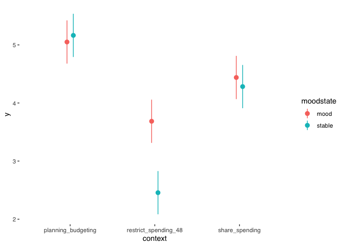

NIH BD/Finhealth Survey - Models
================

``` r
library(tidyverse)
library(lme4)
library(ordinal)
library(psych)
library(ggstats)
library(ggthemes)
library(performance)
library(marginaleffects)
library(kableExtra)
library(flextable)
```

## Load data

``` r
load('data/NIH_survey.Rdata')
```

## Descriptive statistics

### Summary statistics of all variables

``` r
summary(wide)
```

    ##     pguid           Submission id      Participant id        Status          Custom study tncs accepted at  Started at        Completed at       Reviewed at        Archived at       
    ##  Length:500         Length:500         Length:500         Length:500         Length:500                    Length:500         Length:500         Length:500         Length:500        
    ##  Class :character   Class :character   Class :character   Class :character   Class :character              Class :character   Class :character   Class :character   Class :character  
    ##  Mode  :character   Mode  :character   Mode  :character   Mode  :character   Mode  :character              Mode  :character   Mode  :character   Mode  :character   Mode  :character  
    ##                                                                                                                                                                                       
    ##                                                                                                                                                                                       
    ##                                                                                                                                                                                       
    ##    Time taken       Completion code    Total approvals  Chronic condition/illness details      Age             Sex            Ethnicity simplified Country of birth   Country of residence
    ##  Min.   :   260.0   Length:500         Min.   :   0.0   Length:500                        Min.   : 18.00   Length:500         Length:500           Length:500         Length:500          
    ##  1st Qu.:   480.0   Class :character   1st Qu.: 329.0   Class :character                  1st Qu.: 28.00   Class :character   Class :character     Class :character   Class :character    
    ##  Median :   655.5   Mode  :character   Median : 881.5   Mode  :character                  Median : 35.00   Mode  :character   Mode  :character     Mode  :character   Mode  :character    
    ##  Mean   :  1109.6                      Mean   :1465.1                                     Mean   : 37.71                                                                                  
    ##  3rd Qu.:   889.8                      3rd Qu.:2129.5                                     3rd Qu.: 45.00                                                                                  
    ##  Max.   :173363.0                      Max.   :7418.0                                     Max.   :104.00                                                                                  
    ##  Nationality          Language         Student status     Employment status   participant    completed_date     prolific_id          duration           progress           finished        
    ##  Length:500         Length:500         Length:500         Length:500         Min.   :  8.0   Length:500         Length:500         Length:500         Length:500         Length:500        
    ##  Class :character   Class :character   Class :character   Class :character   1st Qu.:136.8   Class :character   Class :character   Class :character   Class :character   Class :character  
    ##  Mode  :character   Mode  :character   Mode  :character   Mode  :character   Median :266.5   Mode  :character   Mode  :character   Mode  :character   Mode  :character   Mode  :character  
    ##                                                                              Mean   :266.3                                                                                                 
    ##                                                                              3rd Qu.:394.2                                                                                                 
    ##                                                                              Max.   :539.0                                                                                                 
    ##    consent              age               gender           ethnicity           hispanic            state           regionality        diagnosis_tf       diagnosis_subtype  diagnosis_age     
    ##  Length:500         Length:500         Length:500         Length:500         Length:500         Length:500         Length:500         Length:500         Length:500         Length:500        
    ##  Class :character   Class :character   Class :character   Class :character   Class :character   Class :character   Class :character   Class :character   Class :character   Class :character  
    ##  Mode  :character   Mode  :character   Mode  :character   Mode  :character   Mode  :character   Mode  :character   Mode  :character   Mode  :character   Mode  :character   Mode  :character  
    ##                                                                                                                                                                                               
    ##                                                                                                                                                                                               
    ##                                                                                                                                                                                               
    ##  hospitalization        PAD              marital           education          employment           income             banked            savings          pay_later_service  main_financial_goal
    ##  Length:500         Length:500         Length:500         Length:500         Length:500         Length:500         Length:500         Length:500         Length:500         Length:500         
    ##  Class :character   Class :character   Class :character   Class :character   Class :character   Class :character   Class :character   Class :character   Class :character   Class :character   
    ##  Mode  :character   Mode  :character   Mode  :character   Mode  :character   Mode  :character   Mode  :character   Mode  :character   Mode  :character   Mode  :character   Mode  :character   
    ##                                                                                                                                                                                                
    ##                                                                                                                                                                                                
    ##                                                                                                                                                                                                
    ##  bankruptcy_declared bankruptcy_considered care_partner_help  collaborative_strategies collaborative_strat_appr_1 collaborative_strat_appr_2 collaborative_strat_appr_3 collaborative_strat_appr_4
    ##  Length:500          Length:500            Length:500         Length:500               Length:500                 Length:500                 Length:500                 Length:500                
    ##  Class :character    Class :character      Class :character   Class :character         Class :character           Class :character           Class :character           Class :character          
    ##  Mode  :character    Mode  :character      Mode  :character   Mode  :character         Mode  :character           Mode  :character           Mode  :character           Mode  :character          
    ##                                                                                                                                                                                                   
    ##                                                                                                                                                                                                   
    ##                                                                                                                                                                                                   
    ##  collaborative_strat_appr_5 collaborative_strat_appr_6 care_partner_feelings_1 care_partner_feelings_2 care_partner_feelings_3 care_partner_feelings_4 care_partner_feelings_5 care_partner_feelings_6
    ##  Length:500                 Length:500                 Length:500              Length:500              Length:500              Length:500              Length:500              Length:500             
    ##  Class :character           Class :character           Class :character        Class :character        Class :character        Class :character        Class :character        Class :character       
    ##  Mode  :character           Mode  :character           Mode  :character        Mode  :character        Mode  :character        Mode  :character        Mode  :character        Mode  :character       
    ##                                                                                                                                                                                                       
    ##                                                                                                                                                                                                       
    ##                                                                                                                                                                                                       
    ##  care_partner_no_collab_1 care_partner_no_collab_2 care_partner_no_collab_3 care_partner_no_collab_4 care_partner_no_collab_5 care_partner_no_collab_6 conflict_mitigation trust_clinician   
    ##  Length:500               Length:500               Length:500               Length:500               Length:500               Length:500               Length:500          Length:500        
    ##  Class :character         Class :character         Class :character         Class :character         Class :character         Class :character         Class :character    Class :character  
    ##  Mode  :character         Mode  :character         Mode  :character         Mode  :character         Mode  :character         Mode  :character         Mode  :character    Mode  :character  
    ##                                                                                                                                                                                              
    ##                                                                                                                                                                                              
    ##                                                                                                                                                                                              
    ##   trust_bank        trust_carepartner      cfpb_1          cfpb_2          cfpb_3          cfpb_4          cfpb_5      bfi_1_reserved  bfi_2_trusting    bfi_3_lazy bfi_4_relaxed  bfi_5_few_artistic
    ##  Length:500         Length:500         Min.   :0.000   Min.   :0.000   Min.   :0.000   Min.   :0.000   Min.   :0.000   Min.   :0.000   Min.   :0.000   Min.   :0    Min.   :0.00   Min.   :0.000     
    ##  Class :character   Class :character   1st Qu.:3.000   1st Qu.:3.000   1st Qu.:3.000   1st Qu.:1.000   1st Qu.:0.750   1st Qu.:2.000   1st Qu.:2.000   1st Qu.:2    1st Qu.:1.00   1st Qu.:1.000     
    ##  Mode  :character   Mode  :character   Median :3.000   Median :4.000   Median :4.000   Median :2.000   Median :1.000   Median :4.000   Median :4.000   Median :3    Median :2.00   Median :2.000     
    ##                                        Mean   :3.446   Mean   :3.568   Mean   :3.998   Mean   :2.424   Mean   :1.406   Mean   :3.494   Mean   :3.146   Mean   :3    Mean   :2.44   Mean   :2.256     
    ##                                        3rd Qu.:5.000   3rd Qu.:5.000   3rd Qu.:5.000   3rd Qu.:3.000   3rd Qu.:2.000   3rd Qu.:5.000   3rd Qu.:4.000   3rd Qu.:4    3rd Qu.:3.00   3rd Qu.:3.000     
    ##                                        Max.   :5.000   Max.   :5.000   Max.   :5.000   Max.   :5.000   Max.   :5.000   Max.   :5.000   Max.   :5.000   Max.   :5    Max.   :5.00   Max.   :5.000     
    ##  bfi_6_outgoing  bfi_7_fault    bfi_8_thorough bfi_9_nervous  bfi_10_imagination v1.understand_behavior.clinicians.share_spending.mood v2.understand_behavior.clinicians.share_spending.stable
    ##  Min.   :0.00   Min.   :0.000   Min.   :0.0    Min.   :0.00   Min.   :0.000      Length:500                                            Length:500                                             
    ##  1st Qu.:2.00   1st Qu.:2.000   1st Qu.:3.0    1st Qu.:3.00   1st Qu.:4.000      Class :character                                      Class :character                                       
    ##  Median :3.00   Median :3.000   Median :4.0    Median :4.00   Median :5.000      Mode  :character                                      Mode  :character                                       
    ##  Mean   :2.79   Mean   :2.998   Mean   :3.9    Mean   :3.82   Mean   :4.258                                                                                                                   
    ##  3rd Qu.:4.00   3rd Qu.:4.000   3rd Qu.:5.0    3rd Qu.:5.00   3rd Qu.:5.000                                                                                                                   
    ##  Max.   :5.00   Max.   :5.000   Max.   :5.0    Max.   :5.00   Max.   :5.000                                                                                                                   
    ##  v3.understand_behavior.carepartner.share_spending.mood v4.understand_behavior.carepartner.share_spending.stable v5.understand_behavior.banks.share_spending.mood
    ##  Length:500                                             Length:500                                               Length:500                                      
    ##  Class :character                                       Class :character                                         Class :character                                
    ##  Mode  :character                                       Mode  :character                                         Mode  :character                                
    ##                                                                                                                                                                  
    ##                                                                                                                                                                  
    ##                                                                                                                                                                  
    ##  v6.understand_behavior.banks.share_spending.stable v7.budgeting.clinicians.planning_budgeting.mood v8.budgeting.clinicians.planning_budgeting.stable v9.budgeting.carepartner.planning_budgeting.mood
    ##  Length:500                                         Length:500                                      Length:500                                        Length:500                                      
    ##  Class :character                                   Class :character                                Class :character                                  Class :character                                
    ##  Mode  :character                                   Mode  :character                                Mode  :character                                  Mode  :character                                
    ##                                                                                                                                                                                                       
    ##                                                                                                                                                                                                       
    ##                                                                                                                                                                                                       
    ##  v10.budgeting.carepartner.planning_budgeting.stable v11.budgeting.banks.planning_budgeting.mood v12.budgeting.banks.planning_budgeting.stable v13.restrict.clinicians.restrict_spending_48.mood
    ##  Length:500                                          Length:500                                  Length:500                                    Length:500                                       
    ##  Class :character                                    Class :character                            Class :character                              Class :character                                 
    ##  Mode  :character                                    Mode  :character                            Mode  :character                              Mode  :character                                 
    ##                                                                                                                                                                                                 
    ##                                                                                                                                                                                                 
    ##                                                                                                                                                                                                 
    ##  v14.restrict.clinicians.restrict_spending_48.stable v15.restrict.carepartner.restrict_spending_48.mood v16.restrict.carepartner.restrict_spending_48.stable
    ##  Length:500                                          Length:500                                         Length:500                                          
    ##  Class :character                                    Class :character                                   Class :character                                    
    ##  Mode  :character                                    Mode  :character                                   Mode  :character                                    
    ##                                                                                                                                                             
    ##                                                                                                                                                             
    ##                                                                                                                                                             
    ##  v17.restrict.banks.restrict_spending_48.mood v18.restrict.banks.restrict_spending_48.stable    speeder      cfpb_age_group    cfpb_score    bfi_extraversion bfi_agreeableness bfi_conscientiousness
    ##  Length:500                                   Length:500                                     Min.   :0.000   Min.   :0.000   Min.   :21.00   Min.   :1.500    Min.   :1.500     Min.   :1.00         
    ##  Class :character                             Class :character                               1st Qu.:0.000   1st Qu.:1.000   1st Qu.:57.00   1st Qu.:2.500    1st Qu.:3.000     1st Qu.:3.00         
    ##  Mode  :character                             Mode  :character                               Median :0.000   Median :1.000   Median :63.00   Median :3.500    Median :5.000     Median :3.50         
    ##                                                                                              Mean   :0.082   Mean   :0.944   Mean   :62.24   Mean   :3.634    Mean   :4.647     Mean   :3.45         
    ##                                                                                              3rd Qu.:0.000   3rd Qu.:1.000   3rd Qu.:65.00   3rd Qu.:4.500    3rd Qu.:6.000     3rd Qu.:4.00         
    ##                                                                                              Max.   :1.000   Max.   :1.000   Max.   :82.00   Max.   :7.500    Max.   :7.500     Max.   :5.00         
    ##  bfi_neuroticism  bfi_openness  
    ##  Min.   :1.50    Min.   :1.500  
    ##  1st Qu.:4.00    1st Qu.:4.500  
    ##  Median :6.00    Median :6.000  
    ##  Mean   :5.47    Mean   :5.873  
    ##  3rd Qu.:6.50    3rd Qu.:7.500  
    ##  Max.   :7.50    Max.   :8.000

### Means of outcome for each vignette

``` r
tab <- long %>% group_by(actors, context, moodstate) %>%
summarize(
          Mean = mean(y, na.rm = TRUE),
          Median = median(y, na.rm = TRUE),
          SD = sd(y, na.rm = TRUE),
          ci = list(mean_cl_normal(y, conf.int = .95)),
          obs = n_distinct(participant)
) %>% unnest(c(ci))
theme_vanilla(flextable(tab)) %>% colformat_double(digits = 2)
```


## Factor analysis

``` r
# TODO: relevel trust_* as ordered numeric
# TODO: FA

#wide %>% select (trust_carepartner, trust_clinician, trust_bank) %>% mutate_all(scale) %>% fa(., nfactors=1, fm='pa', rotate='varimax')
```

## Modeling

### Unconditional means

``` r
unconditional.means <- lmer(y ~ 1 + (1|participant) + (1|item), data=long)
summary(unconditional.means)
```

    ## Linear mixed model fit by REML ['lmerMod']
    ## Formula: y ~ 1 + (1 | participant) + (1 | item)
    ##    Data: long
    ## 
    ## REML criterion at convergence: 41202.1
    ## 
    ## Scaled residuals: 
    ##     Min      1Q  Median      3Q     Max 
    ## -3.3243 -0.6615 -0.0134  0.6369  4.1194 
    ## 
    ## Random effects:
    ##  Groups      Name        Variance Std.Dev.
    ##  participant (Intercept) 4.257    2.063   
    ##  item        (Intercept) 1.583    1.258   
    ##  Residual                4.869    2.207   
    ## Number of obs: 8982, groups:  participant, 499; item, 18
    ## 
    ## Fixed effects:
    ##             Estimate Std. Error t value
    ## (Intercept)   4.1795     0.3115   13.42

``` r
performance::icc(unconditional.means, by_group=TRUE)
```

    ## # ICC by Group
    ## 
    ## Group       |   ICC
    ## -------------------
    ## participant | 0.398
    ## item        | 0.148

### Primary model

``` r
m1 <- lmer(y ~ 1 + actors + context + moodstate + age + gender + education + ethnicity + hispanic + diagnosis_subtype + hospitalization + banked + savings + trust_clinician + trust_carepartner + trust_bank + cfpb_score + care_partner_help + bfi_agreeableness + (1|participant) + (1|item), data=long)

summary(m1)
```

    ## Linear mixed model fit by REML ['lmerMod']
    ## Formula: y ~ 1 + actors + context + moodstate + age + gender + education +      ethnicity + hispanic + diagnosis_subtype + hospitalization +  
    ##     banked + savings + trust_clinician + trust_carepartner +      trust_bank + cfpb_score + care_partner_help + bfi_agreeableness +      (1 | participant) + (1 | item)
    ##    Data: long
    ## 
    ## REML criterion at convergence: 40492.5
    ## 
    ## Scaled residuals: 
    ##     Min      1Q  Median      3Q     Max 
    ## -3.3651 -0.6553 -0.0106  0.6349  4.1675 
    ## 
    ## Random effects:
    ##  Groups      Name        Variance Std.Dev.
    ##  participant (Intercept) 3.3373   1.8268  
    ##  item        (Intercept) 0.1854   0.4306  
    ##  Residual                4.8505   2.2024  
    ## Number of obs: 8874, groups:  participant, 493; item, 18
    ## 
    ## Fixed effects:
    ##                                                                 Estimate Std. Error t value
    ## (Intercept)                                                    4.617e+00  2.477e+00   1.864
    ## actorscarepartner                                              1.875e+00  2.551e-01   7.350
    ## actorsclinicians                                               1.321e+00  2.551e-01   5.179
    ## contextrestrict_spending_48                                   -2.017e+00  2.551e-01  -7.906
    ## contextshare_spending                                         -7.211e-01  2.551e-01  -2.827
    ## moodstatestable                                               -4.282e-01  2.083e-01  -2.056
    ## age25 to 34                                                    1.514e-01  2.901e-01   0.522
    ## age35 to 44                                                   -6.639e-03  3.163e-01  -0.021
    ## age45 to 54                                                   -1.435e-01  3.570e-01  -0.402
    ## age55 to 64                                                   -3.355e-01  4.286e-01  -0.783
    ## age65 to 74                                                    1.335e-01  5.777e-01   0.231
    ## age75 or older                                                -4.579e-01  1.198e+00  -0.382
    ## genderNon-binary                                               4.664e-01  3.957e-01   1.179
    ## genderPrefer not to disclose                                   1.796e-01  1.129e+00   0.159
    ## genderPrefer to self-describe                                 -5.115e-01  8.963e-01  -0.571
    ## genderWoman                                                   -3.754e-01  1.989e-01  -1.887
    ## educationother                                                -7.450e-01  1.037e+00  -0.719
    ## educationprimary school                                       -9.178e-01  8.958e-01  -1.025
    ## educationprofessional or doctorate degree (MD, PhD, JD, etc.) -8.523e-01  8.758e-01  -0.973
    ## educationsecondary/high school (or equivalent)                -4.364e-01  4.010e-01  -1.088
    ## educationsome university                                      -5.174e-01  3.697e-01  -1.399
    ## educationuniversity graduate (4 year)                         -4.304e-01  3.655e-01  -1.178
    ## educationvocational/technical school (2 year)                 -3.813e-01  4.100e-01  -0.930
    ## ethnicityAsian                                                -1.438e-01  1.130e+00  -0.127
    ## ethnicityBlack or African American                            -3.087e-01  1.018e+00  -0.303
    ## ethnicityMore than One Race                                   -6.507e-01  1.017e+00  -0.640
    ## ethnicityUnknown or Not Reported                              -5.826e-01  1.129e+00  -0.516
    ## ethnicityWhite                                                -7.564e-01  9.803e-01  -0.772
    ## hispanicYes                                                   -1.459e-01  3.043e-01  -0.479
    ## diagnosis_subtypeCyclothymia                                  -6.683e-01  6.882e-01  -0.971
    ## diagnosis_subtypeI do not know                                -4.108e-02  3.671e-01  -0.112
    ## diagnosis_subtypeType I                                       -1.254e-02  2.657e-01  -0.047
    ## diagnosis_subtypeType II                                       1.930e-01  2.326e-01   0.830
    ## hospitalizationNot sure                                        1.576e-01  5.650e-01   0.279
    ## hospitalizationYes                                             3.087e-01  1.826e-01   1.690
    ## bankedNo                                                      -1.642e+00  2.445e+00  -0.672
    ## bankedYes                                                     -1.606e+00  2.409e+00  -0.667
    ## savingsNo                                                     -4.148e-01  1.488e+00  -0.279
    ## savingsYes                                                    -5.808e-01  1.490e+00  -0.390
    ## trust_clinicianExtremely easy                                  1.373e+00  4.636e-01   2.962
    ## trust_clinicianNeither easy nor difficult                      9.176e-02  4.821e-01   0.190
    ## trust_clinicianSomewhat difficult                              7.334e-02  4.550e-01   0.161
    ## trust_clinicianSomewhat easy                                   8.957e-01  4.502e-01   1.989
    ## trust_carepartnerExtremely easy                                6.017e-01  5.663e-01   1.063
    ## trust_carepartnerNeither easy nor difficult                    3.677e-01  5.814e-01   0.632
    ## trust_carepartnerSomewhat difficult                            4.637e-01  5.881e-01   0.788
    ## trust_carepartnerSomewhat easy                                 2.886e-01  5.523e-01   0.522
    ## trust_bankExtremely easy                                       1.846e+00  5.139e-01   3.592
    ## trust_bankNeither easy nor difficult                           9.493e-01  2.595e-01   3.659
    ## trust_bankSomewhat difficult                                   1.027e+00  2.357e-01   4.356
    ## trust_bankSomewhat easy                                        1.867e+00  3.424e-01   5.452
    ## cfpb_score                                                     1.102e-02  1.288e-02   0.855
    ## care_partner_helpNot sure                                      7.593e-01  6.853e-01   1.108
    ## care_partner_helpYes                                           1.022e+00  1.988e-01   5.142
    ## bfi_agreeableness                                             -8.497e-05  5.880e-02  -0.001

    ## 
    ## Correlation matrix not shown by default, as p = 55 > 12.
    ## Use print(x, correlation=TRUE)  or
    ##     vcov(x)        if you need it

``` r
car::Anova(m1, type=3)
```

    ## Analysis of Deviance Table (Type III Wald chisquare tests)
    ## 
    ## Response: y
    ##                     Chisq Df Pr(>Chisq)    
    ## (Intercept)        3.4748  1    0.06231 .  
    ## actors            57.0323  2  4.127e-13 ***
    ## context           64.1987  2  1.147e-14 ***
    ## moodstate          4.2265  1    0.03980 *  
    ## age                2.5410  6    0.86385    
    ## gender             7.5825  4    0.10813    
    ## education          2.7307  7    0.90875    
    ## ethnicity          3.2288  5    0.66475    
    ## hispanic           0.2299  1    0.63161    
    ## diagnosis_subtype  2.4247  4    0.65817    
    ## hospitalization    2.8569  2    0.23968    
    ## banked             0.4523  2    0.79760    
    ## savings            0.6926  2    0.70731    
    ## trust_clinician   23.6421  4  9.421e-05 ***
    ## trust_carepartner  2.6355  4    0.62055    
    ## trust_bank        43.7216  4  7.330e-09 ***
    ## cfpb_score         0.7315  1    0.39241    
    ## care_partner_help 26.7831  2  1.528e-06 ***
    ## bfi_agreeableness  0.0000  1    0.99885    
    ## ---
    ## Signif. codes:  0 '***' 0.001 '**' 0.01 '*' 0.05 '.' 0.1 ' ' 1

### Main effects

``` r
# H1.1: Comfort ratings will be lower during stable periods vs. symptomatic periods
# pairwise test
# m2 is main effects model

m2 <- lmer(y ~ 1 + actors + context + moodstate + (1|participant) + (1|item), data=long)
hypotheses(avg_predictions(m2, by='moodstate', re.form=NULL))
```

    ## 
    ##  moodstate Estimate Std. Error    z Pr(>|z|)     S 2.5 % 97.5 %
    ##     mood       4.39      0.174 25.3   <0.001 465.9  4.05   4.73
    ##     stable     3.97      0.174 22.8   <0.001 381.0  3.63   4.31
    ## 
    ## Type:  response 
    ## Columns: moodstate, estimate, std.error, statistic, p.value, s.value, conf.low, conf.high

``` r
hypotheses(avg_predictions(m2, by='moodstate', re.form=NULL), 'b2=b1')
```

    ## Warning: 
    ## It is essential to check the order of estimates when specifying hypothesis tests using positional indices like b1, b2, etc. The indices of estimates can change depending on the order of rows in the original dataset, user-supplied arguments, model-fitting package, and version of `marginaleffects`. 
    ## 
    ## It is also good practice to use assertions that ensure the order of estimates is consistent across different runs of the same code. Example:
    ## 
    ## ```r
    ## mod <- lm(mpg ~ am * carb, data = mtcars)
    ## 
    ## # assertion for safety
    ## p <- avg_predictions(mod, by = 'carb')
    ## stopifnot(p$carb[1] != 1 || p$carb[2] != 2)
    ## 
    ## # hypothesis test
    ## avg_predictions(mod, by = 'carb', hypothesis = 'b1 - b2 = 0')
    ## ```
    ## 
    ## Disable this warning with: `options(marginaleffects_safe = FALSE)`
    ## This warning appears once per session.

    ## 
    ##   Term Estimate Std. Error     z Pr(>|z|)   S  2.5 %  97.5 %
    ##  b2=b1   -0.424      0.208 -2.04   0.0416 4.6 -0.832 -0.0161
    ## 
    ## Type:  response 
    ## Columns: term, estimate, std.error, statistic, p.value, s.value, conf.low, conf.high

``` r
# H2.1: Among intervention levels, comfort ratings will be lowest for spending restrictions
# calculate as the difference between an estimate and the mean of all estimates

hypotheses(avg_predictions(m2, by='context', re.form=NULL), 'meandev')
```

    ## 
    ##      Hypothesis              context Estimate Std. Error     z Pr(>|z|)    S  2.5 % 97.5 %
    ##  Mean deviation planning_budgeting      0.927      0.147  6.30   <0.001 31.7  0.639   1.22
    ##  Mean deviation restrict_spending_48   -1.109      0.147 -7.53   <0.001 44.2 -1.397  -0.82
    ##  Mean deviation share_spending          0.181      0.147  1.23    0.218  2.2 -0.107   0.47
    ## 
    ## Type:  response 
    ## Columns: hypothesis, context, estimate, std.error, statistic, p.value, s.value, conf.low, conf.high

``` r
# H3.1: Comfort will be highest for care partners
# as meandev, like above

hypotheses(avg_predictions(m2, variables='actors', re.form=NULL), multcomp='holm')
```

    ## Warning: These arguments are not known to be supported for models of class `lmerMod`: multcomp. These arguments are known to be valid: include_random, re.form, allow.new.levels, random.only. All
    ## arguments are still passed to the model-specific prediction function, but users are encouraged to check if the argument is indeed supported by their modeling package. Please file a request on Github
    ## if you believe that an unknown argument should be added to the `marginaleffects` white list of known arguments, in order to avoid raising this warning:
    ## https://github.com/vincentarelbundock/marginaleffects/issues

    ## 
    ##       actors Estimate Std. Error    z Pr(>|z|)     S 2.5 % 97.5 %
    ##  banks           3.11      0.203 15.4   <0.001 174.3  2.71   3.51
    ##  carepartner     4.99      0.203 24.6   <0.001 442.4  4.59   5.38
    ##  clinicians      4.44      0.203 21.9   <0.001 352.0  4.05   4.84
    ## 
    ## Type:  response 
    ## Columns: actors, estimate, std.error, statistic, p.value, s.value, conf.low, conf.high

### Interaction effects

``` r
# H1.2: Among intervention levels, comfort ratings will be highest for shared spending behaviors during mood episodes
# m3 is interaction between intervention context and mood state

m3 <- lmer(y ~ actors + context * moodstate + (1|participant) + (1|item), data=long)
avg_predictions(m3, by=c('moodstate', 'context'), hypothesis='meandev', re.form=NULL)
```

    ## 
    ##      Hypothesis moodstate              context Estimate Std. Error       z Pr(>|z|)    S   2.5 % 97.5 %
    ##  Mean deviation    mood   planning_budgeting      0.871      0.151   5.751   <0.001 26.7  0.5739  1.167
    ##  Mean deviation    mood   restrict_spending_48   -0.494      0.151  -3.264   0.0011  9.8 -0.7908 -0.197
    ##  Mean deviation    mood   share_spending          0.259      0.151   1.714   0.0866  3.5 -0.0373  0.556
    ##  Mean deviation    stable planning_budgeting      0.984      0.151   6.501   <0.001 33.5  0.6875  1.281
    ##  Mean deviation    stable restrict_spending_48   -1.723      0.151 -11.383   <0.001 97.3 -2.0199 -1.427
    ##  Mean deviation    stable share_spending          0.103      0.151   0.681   0.4959  1.0 -0.1936  0.400
    ## 
    ## Type:  response 
    ## Columns: hypothesis, moodstate, context, estimate, std.error, statistic, p.value, s.value, conf.low, conf.high

``` r
plot_predictions(m3, by=c('context', 'moodstate')) + theme_tufte(base_family='sans')
```

    ## Warning: For this model type, `marginaleffects` only takes into account the uncertainty in fixed-effect parameters. You can use the `re.form=NA` or `re.form=NULL` arguments to acknowledge
    ##   this explicitly and silence this warning.

<!-- -->

``` r
# H1.3: Among intervention levels, comfort ratings for spending restrictions will be higher during mood episodes vs. during stable periods (H0: 'b2=b5')

avg_predictions(m3, by=c('moodstate', 'context'))
```

    ## Warning: For this model type, `marginaleffects` only takes into account the uncertainty in fixed-effect parameters. You can use the `re.form=NA` or `re.form=NULL` arguments to acknowledge
    ##   this explicitly and silence this warning.

    ## 
    ##  moodstate              context Estimate Std. Error    z Pr(>|z|)     S 2.5 % 97.5 %
    ##     mood   planning_budgeting       5.05       0.19 26.6   <0.001 515.6  4.68   5.42
    ##     mood   restrict_spending_48     3.69       0.19 19.4   <0.001 276.5  3.31   4.06
    ##     mood   share_spending           4.44       0.19 23.4   <0.001 399.3  4.07   4.81
    ##     stable planning_budgeting       5.16       0.19 27.2   <0.001 538.9  4.79   5.54
    ##     stable restrict_spending_48     2.46       0.19 12.9   <0.001 124.8  2.08   2.83
    ##     stable share_spending           4.28       0.19 22.6   <0.001 372.0  3.91   4.65
    ## 
    ## Type:  response 
    ## Columns: moodstate, context, estimate, std.error, statistic, p.value, s.value, conf.low, conf.high

``` r
avg_predictions(m3, by=c('moodstate', 'context'), hypothesis='b2=b5', re.form=NULL)
```

    ## 
    ##   Term Estimate Std. Error    z Pr(>|z|)    S 2.5 % 97.5 %
    ##  b2=b5     1.23      0.235 5.24   <0.001 22.6 0.769   1.69
    ## 
    ## Type:  response 
    ## Columns: term, estimate, std.error, statistic, p.value, s.value, conf.low, conf.high

### Interaction effects with respondent characteristics

``` r
# H2.2: Evidence of advanced planning behaviors (operationalized as the prior creation of a psychiatric advanced directive) will lead to higher comfort ratings when sharing spending behaviors

m4 <- lmer(y ~ actors + context * PAD + moodstate + (1|participant) + (1|item), data=long)
avg_predictions(m4, by=c('PAD', 'context'))
```

    ## Warning: For this model type, `marginaleffects` only takes into account the uncertainty in fixed-effect parameters. You can use the `re.form=NA` or `re.form=NULL` arguments to acknowledge
    ##   this explicitly and silence this warning.

    ## 
    ##       PAD              context Estimate Std. Error     z Pr(>|z|)     S 2.5 % 97.5 %
    ##  No       planning_budgeting       5.06      0.207 24.47   <0.001 436.8  4.65   5.46
    ##  No       restrict_spending_48     2.98      0.207 14.42   <0.001 154.2  2.58   3.39
    ##  No       share_spending           4.29      0.207 20.73   <0.001 314.8  3.88   4.69
    ##  Not sure planning_budgeting       4.83      0.408 11.84   <0.001 105.1  4.03   5.63
    ##  Not sure restrict_spending_48     3.21      0.408  7.86   <0.001  47.9  2.41   4.01
    ##  Not sure share_spending           4.11      0.408 10.08   <0.001  76.9  3.31   4.91
    ##  Yes      planning_budgeting       5.86      0.395 14.82   <0.001 162.7  5.09   6.64
    ##  Yes      restrict_spending_48     3.88      0.395  9.81   <0.001  73.0  3.10   4.65
    ##  Yes      share_spending           5.37      0.395 13.58   <0.001 137.1  4.60   6.15
    ## 
    ## Type:  response 
    ## Columns: PAD, context, estimate, std.error, statistic, p.value, s.value, conf.low, conf.high

``` r
avg_predictions(m4, by=c('PAD', 'context'), hypothesis='b9=b3')
```

    ## Warning: For this model type, `marginaleffects` only takes into account the uncertainty in fixed-effect parameters. You can use the `re.form=NA` or `re.form=NULL` arguments to acknowledge
    ##   this explicitly and silence this warning.

    ## 
    ##   Term Estimate Std. Error    z Pr(>|z|)   S 2.5 % 97.5 %
    ##  b9=b3     1.08      0.371 2.92  0.00345 8.2 0.357   1.81
    ## 
    ## Type:  response 
    ## Columns: term, estimate, std.error, statistic, p.value, s.value, conf.low, conf.high

``` r
# H2.3: Evidence of adverse financial events (operationalized as prior bankruptcy) will lead to higher comfort ratings of spending restrictions

m5 <- lmer(y ~ actors + context * bankruptcy_declared + moodstate + (1|participant) + (1|item), data=long)
avg_predictions(m5, by=c('bankruptcy_declared', 'context'))
```

    ## Warning: For this model type, `marginaleffects` only takes into account the uncertainty in fixed-effect parameters. You can use the `re.form=NA` or `re.form=NULL` arguments to acknowledge
    ##   this explicitly and silence this warning.

    ## 
    ##  bankruptcy_declared              context Estimate Std. Error     z Pr(>|z|)     S 2.5 % 97.5 %
    ##             No       planning_budgeting       5.12      0.206 24.80   <0.001 448.6 4.714   5.52
    ##             No       restrict_spending_48     3.00      0.206 14.51   <0.001 156.1 2.591   3.40
    ##             No       share_spending           4.36      0.206 21.12   <0.001 326.4 3.954   4.76
    ##             Not sure planning_budgeting       4.03      0.672  5.99   <0.001  28.9 2.711   5.35
    ##             Not sure restrict_spending_48     2.24      0.672  3.33   <0.001  10.2 0.919   3.55
    ##             Not sure share_spending           3.51      0.672  5.23   <0.001  22.5 2.197   4.83
    ##             Yes      planning_budgeting       5.25      0.346 15.18   <0.001 170.4 4.568   5.92
    ##             Yes      restrict_spending_48     3.82      0.346 11.04   <0.001  91.7 3.138   4.49
    ##             Yes      share_spending           4.56      0.346 13.19   <0.001 129.5 3.881   5.24
    ## 
    ## Type:  response 
    ## Columns: bankruptcy_declared, context, estimate, std.error, statistic, p.value, s.value, conf.low, conf.high

``` r
avg_predictions(m5, by=c('bankruptcy_declared', 'context'), hypothesis='b8=b2')
```

    ## Warning: For this model type, `marginaleffects` only takes into account the uncertainty in fixed-effect parameters. You can use the `re.form=NA` or `re.form=NULL` arguments to acknowledge
    ##   this explicitly and silence this warning.

    ## 
    ##   Term Estimate Std. Error    z Pr(>|z|)   S 2.5 % 97.5 %
    ##  b8=b2     0.82      0.317 2.59   0.0096 6.7   0.2   1.44
    ## 
    ## Type:  response 
    ## Columns: term, estimate, std.error, statistic, p.value, s.value, conf.low, conf.high

``` r
# H3.2: Higher levels of trust in third parties will be associated with higher comfort ratings for those respective third parties

# 3.2.1 High trust in clinicians predicts higher comfort ratings for Actor=Clinician
m6.1 <- lmer(y ~ actors * trust_clinician + context + moodstate + (1|participant) + (1|item), data=long)
avg_predictions(m6.1, by=c('trust_clinician', 'actors'))
```

    ## Warning: For this model type, `marginaleffects` only takes into account the uncertainty in fixed-effect parameters. You can use the `re.form=NA` or `re.form=NULL` arguments to acknowledge
    ##   this explicitly and silence this warning.

    ## 
    ##             trust_clinician      actors Estimate Std. Error     z Pr(>|z|)     S 2.5 % 97.5 %
    ##  Extremely difficult        banks           1.84      0.402  4.59   <0.001  17.8  1.06   2.63
    ##  Extremely difficult        carepartner     3.72      0.402  9.26   <0.001  65.4  2.93   4.51
    ##  Extremely difficult        clinicians      2.60      0.402  6.49   <0.001  33.4  1.82   3.39
    ##  Extremely easy             banks           3.63      0.268 13.55   <0.001 136.5  3.10   4.15
    ##  Extremely easy             carepartner     5.56      0.268 20.75   <0.001 315.4  5.03   6.08
    ##  Extremely easy             clinicians      5.72      0.268 21.37   <0.001 334.0  5.20   6.25
    ##  Neither easy nor difficult banks           2.69      0.323  8.31   <0.001  53.2  2.05   3.32
    ##  Neither easy nor difficult carepartner     4.32      0.323 13.35   <0.001 132.6  3.68   4.95
    ##  Neither easy nor difficult clinicians      3.55      0.323 10.98   <0.001  90.8  2.92   4.18
    ##  Somewhat difficult         banks           2.50      0.299  8.37   <0.001  54.0  1.92   3.09
    ##  Somewhat difficult         carepartner     4.24      0.299 14.16   <0.001 148.7  3.65   4.82
    ##  Somewhat difficult         clinicians      3.16      0.299 10.56   <0.001  84.1  2.57   3.74
    ##  Somewhat easy              banks           3.40      0.229 14.84   <0.001 163.0  2.95   3.85
    ##  Somewhat easy              carepartner     5.39      0.229 23.48   <0.001 402.7  4.94   5.84
    ##  Somewhat easy              clinicians      4.82      0.229 21.00   <0.001 322.8  4.37   5.27
    ## 
    ## Type:  response 
    ## Columns: trust_clinician, actors, estimate, std.error, statistic, p.value, s.value, conf.low, conf.high

``` r
avg_predictions(m6.1, by=c('trust_clinician', 'actors'), hypothesis='b6=b3')
```

    ## Warning: For this model type, `marginaleffects` only takes into account the uncertainty in fixed-effect parameters. You can use the `re.form=NA` or `re.form=NULL` arguments to acknowledge
    ##   this explicitly and silence this warning.

    ## 
    ##   Term Estimate Std. Error    z Pr(>|z|)    S 2.5 % 97.5 %
    ##  b6=b3     3.12      0.414 7.54   <0.001 44.3  2.31   3.93
    ## 
    ## Type:  response 
    ## Columns: term, estimate, std.error, statistic, p.value, s.value, conf.low, conf.high

``` r
# 3.2.2 Trust in care partners predicts higher comfort ratings for Actor=Care partner
m6.2 <- lmer(y ~ actors * trust_carepartner + context + moodstate + (1|participant) + (1|item), data=long)
avg_predictions(m6.2, by=c('trust_carepartner', 'actors'))
```

    ## Warning: For this model type, `marginaleffects` only takes into account the uncertainty in fixed-effect parameters. You can use the `re.form=NA` or `re.form=NULL` arguments to acknowledge
    ##   this explicitly and silence this warning.

    ## 
    ##           trust_carepartner      actors Estimate Std. Error     z Pr(>|z|)     S 2.5 % 97.5 %
    ##  Extremely difficult        banks           2.28      0.509  4.47   <0.001  17.0  1.28   3.28
    ##  Extremely difficult        carepartner     2.90      0.509  5.70   <0.001  26.3  1.91   3.90
    ##  Extremely difficult        clinicians      3.67      0.509  7.20   <0.001  40.6  2.67   4.67
    ##  Extremely easy             banks           3.35      0.248 13.51   <0.001 135.7  2.87   3.84
    ##  Extremely easy             carepartner     6.11      0.248 24.60   <0.001 441.7  5.62   6.59
    ##  Extremely easy             clinicians      4.93      0.248 19.88   <0.001 289.7  4.45   5.42
    ##  Neither easy nor difficult banks           3.06      0.293 10.46   <0.001  82.7  2.49   3.63
    ##  Neither easy nor difficult carepartner     4.18      0.293 14.28   <0.001 151.3  3.60   4.75
    ##  Neither easy nor difficult clinicians      4.01      0.293 13.71   <0.001 139.6  3.44   4.58
    ##  Somewhat difficult         banks           2.67      0.351  7.59   <0.001  44.9  1.98   3.35
    ##  Somewhat difficult         carepartner     3.71      0.351 10.55   <0.001  84.0  3.02   4.39
    ##  Somewhat difficult         clinicians      3.85      0.351 10.96   <0.001  90.5  3.16   4.54
    ##  Somewhat easy              banks           3.16      0.240 13.16   <0.001 129.0  2.69   3.63
    ##  Somewhat easy              carepartner     5.04      0.240 20.99   <0.001 322.6  4.57   5.51
    ##  Somewhat easy              clinicians      4.50      0.240 18.75   <0.001 258.1  4.03   4.97
    ## 
    ## Type:  response 
    ## Columns: trust_carepartner, actors, estimate, std.error, statistic, p.value, s.value, conf.low, conf.high

``` r
avg_predictions(m6.2, by=c('trust_carepartner', 'actors'), hypothesis='b5=b2')
```

    ## Warning: For this model type, `marginaleffects` only takes into account the uncertainty in fixed-effect parameters. You can use the `re.form=NA` or `re.form=NULL` arguments to acknowledge
    ##   this explicitly and silence this warning.

    ## 
    ##   Term Estimate Std. Error    z Pr(>|z|)    S 2.5 % 97.5 %
    ##  b5=b2      3.2      0.509 6.29   <0.001 31.6   2.2    4.2
    ## 
    ## Type:  response 
    ## Columns: term, estimate, std.error, statistic, p.value, s.value, conf.low, conf.high

``` r
# 3.2.3 Trust in banks predicts higher comfort ratings for actor=banks
m6.3 <- lmer(y ~ actors * trust_bank + context + moodstate + (1|participant) + (1|item), data=long)
avg_predictions(m6.3, by=c('trust_bank', 'actors'))
```

    ## Warning: For this model type, `marginaleffects` only takes into account the uncertainty in fixed-effect parameters. You can use the `re.form=NA` or `re.form=NULL` arguments to acknowledge
    ##   this explicitly and silence this warning.

    ## 
    ##                  trust_bank      actors Estimate Std. Error    z Pr(>|z|)     S 2.5 % 97.5 %
    ##  Extremely difficult        banks           1.86      0.232  8.0   <0.001  49.5  1.40   2.31
    ##  Extremely difficult        carepartner     4.55      0.232 19.6   <0.001 281.0  4.09   5.00
    ##  Extremely difficult        clinicians      3.89      0.232 16.7   <0.001 206.6  3.44   4.35
    ##  Extremely easy             banks           5.67      0.549 10.3   <0.001  80.7  4.59   6.74
    ##  Extremely easy             carepartner     5.74      0.549 10.5   <0.001  82.6  4.66   6.81
    ##  Extremely easy             clinicians      5.88      0.549 10.7   <0.001  86.7  4.81   6.96
    ##  Neither easy nor difficult banks           3.89      0.275 14.1   <0.001 148.4  3.35   4.43
    ##  Neither easy nor difficult carepartner     4.89      0.275 17.8   <0.001 233.1  4.36   5.43
    ##  Neither easy nor difficult clinicians      4.52      0.275 16.4   <0.001 199.4  3.98   5.06
    ##  Somewhat difficult         banks           3.36      0.257 13.1   <0.001 127.5  2.86   3.87
    ##  Somewhat difficult         carepartner     5.51      0.257 21.4   <0.001 336.0  5.01   6.01
    ##  Somewhat difficult         clinicians      4.68      0.257 18.2   <0.001 243.9  4.18   5.19
    ##  Somewhat easy              banks           5.15      0.359 14.4   <0.001 153.0  4.45   5.86
    ##  Somewhat easy              carepartner     5.42      0.359 15.1   <0.001 168.9  4.72   6.12
    ##  Somewhat easy              clinicians      5.49      0.359 15.3   <0.001 173.2  4.79   6.19
    ## 
    ## Type:  response 
    ## Columns: trust_bank, actors, estimate, std.error, statistic, p.value, s.value, conf.low, conf.high

``` r
avg_predictions(m6.3, by=c('trust_bank', 'actors'), hypothesis='b4=b1')
```

    ## Warning: For this model type, `marginaleffects` only takes into account the uncertainty in fixed-effect parameters. You can use the `re.form=NA` or `re.form=NULL` arguments to acknowledge
    ##   this explicitly and silence this warning.

    ## 
    ##   Term Estimate Std. Error    z Pr(>|z|)    S 2.5 % 97.5 %
    ##  b4=b1     3.81      0.541 7.04   <0.001 38.9  2.75   4.87
    ## 
    ## Type:  response 
    ## Columns: term, estimate, std.error, statistic, p.value, s.value, conf.low, conf.high

``` r
# H3.3 Prior requests for third-party aid in managing impulsive spending behaviors will be associated with higher comfort ratings across all third-party actors (versus those who have not requested help)

m7 <- lmer(y ~ actors * care_partner_help + context + moodstate + (1|participant) + (1|item), data=long)
hypotheses(avg_predictions(m7, by=c('actors', 'care_partner_help')), 'meandev', multcomp='holm')
```

    ## Warning: For this model type, `marginaleffects` only takes into account the uncertainty in fixed-effect parameters. You can use the `re.form=NA` or `re.form=NULL` arguments to acknowledge
    ##   this explicitly and silence this warning.

    ## Warning: These arguments are not known to be supported for models of class `lmerMod`: multcomp. These arguments are known to be valid: include_random, re.form, allow.new.levels, random.only. All
    ## arguments are still passed to the model-specific prediction function, but users are encouraged to check if the argument is indeed supported by their modeling package. Please file a request on Github
    ## if you believe that an unknown argument should be added to the `marginaleffects` white list of known arguments, in order to avoid raising this warning:
    ## https://github.com/vincentarelbundock/marginaleffects/issues

    ## Warning: For this model type, `marginaleffects` only takes into account the uncertainty in fixed-effect parameters. You can use the `re.form=NA` or `re.form=NULL` arguments to acknowledge
    ##   this explicitly and silence this warning.

    ## 
    ##      Hypothesis      actors care_partner_help Estimate Std. Error      z Pr(>|z|)    S  2.5 % 97.5 %
    ##  Mean deviation banks                No        -1.3822      0.289 -4.782  < 0.001 19.1 -1.949 -0.816
    ##  Mean deviation banks                Not sure  -1.1958      0.542 -2.205  0.02743  5.2 -2.259 -0.133
    ##  Mean deviation banks                Yes       -0.8159      0.299 -2.733  0.00629  7.3 -1.401 -0.231
    ##  Mean deviation carepartner          No         0.0804      0.289  0.278  0.78083  0.4 -0.486  0.647
    ##  Mean deviation carepartner          Not sure   0.0820      0.542  0.151  0.87982  0.2 -0.981  1.145
    ##  Mean deviation carepartner          Yes        1.9027      0.299  6.372  < 0.001 32.3  1.317  2.488
    ##  Mean deviation clinicians           No        -0.2202      0.289 -0.762  0.44620  1.2 -0.787  0.346
    ##  Mean deviation clinicians           Not sure   0.7301      0.542  1.347  0.17813  2.5 -0.333  1.793
    ##  Mean deviation clinicians           Yes        0.8188      0.299  2.742  0.00610  7.4  0.234  1.404
    ## 
    ## Type:  response 
    ## Columns: hypothesis, actors, care_partner_help, estimate, std.error, statistic, p.value, s.value, conf.low, conf.high

``` r
# H4.1: Agreeableness will have a significant (non-directional) effect on level of comfort

m8 <- lmer(y ~ actors + context + moodstate + bfi_agreeableness + (1|participant) + (1|item), data=long)
car::Anova(m8, type=3)
```

    ## Analysis of Deviance Table (Type III Wald chisquare tests)
    ## 
    ## Response: y
    ##                     Chisq Df Pr(>Chisq)    
    ## (Intercept)       81.8359  1  < 2.2e-16 ***
    ## actors            57.4896  2  3.283e-13 ***
    ## context           65.3417  2  6.475e-15 ***
    ## moodstate          4.1509  1   0.041613 *  
    ## bfi_agreeableness  8.6456  1   0.003279 ** 
    ## ---
    ## Signif. codes:  0 '***' 0.001 '**' 0.01 '*' 0.05 '.' 0.1 ' ' 1

## Additional analysis

``` r
long$trust_bank <- ordered(long$trust_bank, levels=c('Extremely difficult', 'Somewhat difficult', 'Neither easy nor difficult', 'Somewhat easy', 'Extremely easy'))
long$trust_carepartner <- ordered(long$trust_carepartner, levels=c('Extremely difficult', 'Somewhat difficult', 'Neither easy nor difficult', 'Somewhat easy', 'Extremely easy'))
long$trust_clinician <- ordered(long$trust_clinician, levels=c('Extremely difficult', 'Somewhat difficult', 'Neither easy nor difficult', 'Somewhat easy', 'Extremely easy'))
```
